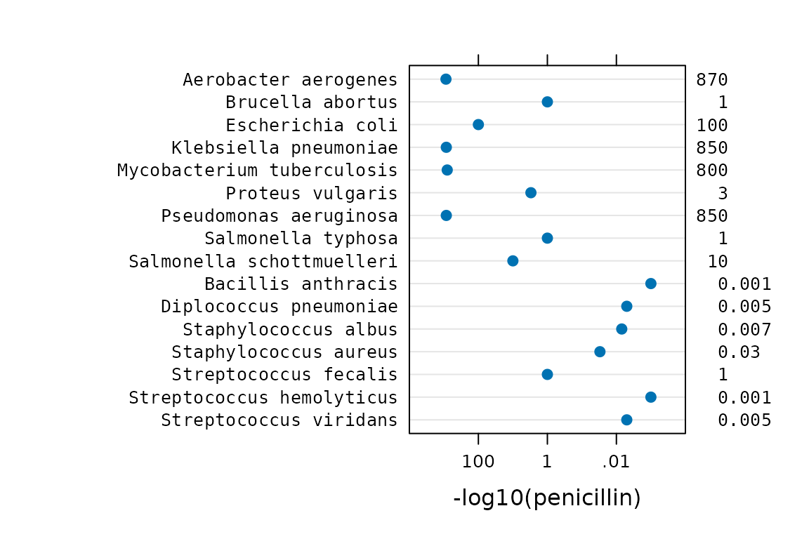

# Lucid printing of floating-point vectors

### Setup

``` r
library("knitr")
    opts_chunk$set(fig.align="center", fig.width=6, fig.height=6)
options(width=90)
```

### Abstract

Farquhar and Farquhar (1891) provide a humorous quote about tables:

> The graphic method has considerable superiority for the exposition of
> statistical facts over the tabular. A heavy bank of figures is
> grievously wearisome to the eye, and the popular mind is as incapable
> of drawing any useful lessons from it as of extracting sunbeams from
> cucumbers.

The `lucid` package intends to make your life easier by helping you
extract information from tables. The package has functions for printing
vectors and tables of floating-point numbers in a human-friendly format.
An application is presented for printing of variance components from
mixed models.

### Introduction

Numerical output from R is often in scientific notation, which can make
it difficult to quickly glance at numbers and understand the relative
sizes of the numbers. This not a new phenomenon. Before R had been
created, Finney (1988) had this to say about numerical output:

> Certainly, in initiating analyses by standard software or in writing
> one’s own software, the aim should be to have output that is easy to
> read and easily intelligible to others. … Especially undesirable is
> the so-called ‘scientific notation’ for numbers in which every number
> is shown as a value between 0.0 and 1.0 with a power of 10 by which it
> must be multiplied. For example:
>
>     0.1234E00 is 0.1234
>     0.1234E02 is 12.34
>     0.1234E-1 is 0.01234
>
> This is an abomination which obscures the comparison of related
> quantities; tables of means or of analyses of variance become very
> difficult to read. It is acceptable as a default when a value is
> unexpectedly very much larger or smaller than its companions, but its
> appearance as standard output denotes either lazy programming or
> failure to use good software properly. Like avoidance of ‘E’, neat
> arrangement of output values in columns, with decimal points on a
> vertical line, requires extra effort by a programmer but should be
> almost mandatory for any software that is to be used often.

One recommendation for improving the display of tables of numbers is to
round numbers to 2 (Wainer 1997) or 3 Clark (1965) digits for the
following reasons:

1.  We cannot *comprehend* more than three digits very easily.
2.  We seldom *care* about accuracy of more than three digits.
3.  We can rarely *justify* more than three digits of accuracy
    statistically.

An alternative to significant digits is the concept of *effective
digits* Kozak et al. (2011), which considers the amount of variation in
the data.

In R, the [`round()`](https://rdrr.io/r/base/Round.html) and
[`signif()`](https://rdrr.io/r/base/Round.html) functions can be used to
round to 3 digits of accuracy, but those functions can still print
results in scientific notation and leave much to be desired. The `lucid`
package provides functions to improve the presentation of floating point
numbers in a clear (or lucid) way that makes interpretation of the
numbers immediately apparent.

Consider the following vector of coefficients from a fitted model:

    ##                    effect
    ## (Intercept)  1.135000e+02
    ## A           -1.350000e+01
    ## B            4.500000e+00
    ## C            2.450000e+01
    ## C1           6.927792e-14
    ## C2          -1.750000e+00
    ## D            1.650000e+01

Questions of interest about the coefficients might include:

1.  Which coefficient is zero?
2.  How large is the intercept?

Both questions can be answered using the output shown above, but it
takes too much effort to answer the questions. Now examine the same
vector of coefficients with prettier formatting:

``` r
require("lucid")
options(digits=7) # knitr defaults to 4, R console uses 7
lucid(df1)
```

    ##             effect
    ## (Intercept) 114   
    ## A           -13.5 
    ## B             4.5 
    ## C            24.5 
    ## C1            0   
    ## C2           -1.75
    ## D            16.5

Which coefficient is zero? How large is the intercept?

Printing the numbers with the
[`lucid()`](http://kwstat.github.io/lucid/reference/lucid.md) function
has made the questions much easier to answer.

The sequence of steps used by
[`lucid()`](http://kwstat.github.io/lucid/reference/lucid.md) to format
and print the output is.

1.  Zap small numbers to zero using
    [`zapsmall()`](https://rdrr.io/r/base/zapsmall.html).
2.  Round using 3 significant digits (user controllable option).
3.  Drop trailing zeros.
4.  Align numbers at the decimal point (text format).

The `lucid` package contains a generic function
[`lucid()`](http://kwstat.github.io/lucid/reference/lucid.md) with
specific methods for numeric vectors, data frames, and lists. The method
for data frames applies formatting to each numeric column and leaves
other columns unchanged. The
[`lucid()`](http://kwstat.github.io/lucid/reference/lucid.md) function
is primarily a *formatting* function, the results of which are passed to
the regular [`print()`](https://rdrr.io/r/base/print.html) functions.

### Example: Antibiotic effectiveness

Wainer and Larsen (2009) present data published by Will Burtin in 1951
on the effectiveness of antibiotics against 16 types of bacteria. The
data is included in the `lucid` package as a dataframe called
`antibiotic`. The default view of this data is:

``` r
print(antibiotic)
```

    ##                      bacteria penicillin streptomycin neomycin gramstain
    ## 1        Aerobacter aerogenes    870.000         1.00    1.600       neg
    ## 2            Brucella abortus      1.000         2.00    0.020       neg
    ## 3            Escherichia coli    100.000         0.40    0.100       neg
    ## 4       Klebsiella pneumoniae    850.000         1.20    1.000       neg
    ## 5  Mycobacterium tuberculosis    800.000         5.00    2.000       neg
    ## 6            Proteus vulgaris      3.000         0.10    0.100       neg
    ## 7      Pseudomonas aeruginosa    850.000         2.00    0.400       neg
    ## 8          Salmonella typhosa      1.000         0.40    0.008       neg
    ## 9   Salmonella schottmuelleri     10.000         0.80    0.090       neg
    ## 10         Bacillis anthracis      0.001         0.01    0.007       pos
    ## 11     Diplococcus pneumoniae      0.005        11.00   10.000       pos
    ## 12       Staphylococcus albus      0.007         0.10    0.001       pos
    ## 13      Staphylococcus aureus      0.030         0.03    0.001       pos
    ## 14      Streptococcus fecalis      1.000         1.00    0.100       pos
    ## 15  Streptococcus hemolyticus      0.001        14.00   10.000       pos
    ## 16     Streptococcus viridans      0.005        10.00   40.000       pos

Due to the wide range in magnitude of the values, nearly half of the
floating-point numbers in the default view contain trailing zeros after
the decimal, which adds significant clutter and impedes interpretation.
The [`lucid()`](http://kwstat.github.io/lucid/reference/lucid.md)
display of the data is:

``` r
lucid(antibiotic)
```

    ##                      bacteria penicillin streptomycin neomycin gramstain
    ## 1        Aerobacter aerogenes    870             1       1.6         neg
    ## 2            Brucella abortus      1             2       0.02        neg
    ## 3            Escherichia coli    100             0.4     0.1         neg
    ## 4       Klebsiella pneumoniae    850             1.2     1           neg
    ## 5  Mycobacterium tuberculosis    800             5       2           neg
    ## 6            Proteus vulgaris      3             0.1     0.1         neg
    ## 7      Pseudomonas aeruginosa    850             2       0.4         neg
    ## 8          Salmonella typhosa      1             0.4     0.008       neg
    ## 9   Salmonella schottmuelleri     10             0.8     0.09        neg
    ## 10         Bacillis anthracis      0.001         0.01    0.007       pos
    ## 11     Diplococcus pneumoniae      0.005        11      10           pos
    ## 12       Staphylococcus albus      0.007         0.1     0.001       pos
    ## 13      Staphylococcus aureus      0.03          0.03    0.001       pos
    ## 14      Streptococcus fecalis      1             1       0.1         pos
    ## 15  Streptococcus hemolyticus      0.001        14      10           pos
    ## 16     Streptococcus viridans      0.005        10      40           pos

The [`lucid()`](http://kwstat.github.io/lucid/reference/lucid.md)
display is dramatically simplified, providing a clear picture of the
effectiveness of the antibiotics against bacteria. This view of the data
matches exactly the appearance of Table 1 in Wainer and Larsen (2009).

A stem-and-leaf plot is a semi-graphical display of data, in that the
*positions* of the numbers create a display similar to a histogram. In a
similar manner, the
[`lucid()`](http://kwstat.github.io/lucid/reference/lucid.md) output is
a semi-graphical view of the data. The figure below shows a dotplot of
the penicillin values on a reverse log10 scale. The values are also
shown along the right axis in
[`lucid()`](http://kwstat.github.io/lucid/reference/lucid.md) format.
Note the similarity in the overall shape of the dots and the positions
of the left-most significant digit in the numerical values along the
right axis.



### Example: Application to mixed models

During the process of iterative fitting of mixed models, it is often
useful to compare fits of different models to data, for example using
loglikelihood or AIC values, or with the help of residual plots. It can
also be very informative to inspect the estimated values of variance
components.

To that end, the generic
[`VarCorr()`](https://rdrr.io/pkg/nlme/man/VarCorr.html) function found
in the `nlme` Pinheiro et al. (2014) and `lme4` Bates et al. (2014)
packages can be used to print variance estimates from fitted models. The
[`VarCorr()`](https://rdrr.io/pkg/nlme/man/VarCorr.html) function is not
available for models obtained using the `asreml` Butler (2009) package.

The `lucid` package provides a generic function called
[`vc()`](http://kwstat.github.io/lucid/reference/vc.md) that provides a
unified interface for extracting the variance components from fitted
models obtained from the `asreml`, `lme4`, `nlme`, and `rjags` packages.
The [`vc()`](http://kwstat.github.io/lucid/reference/vc.md) function has
methods specific to each package that make it easy to extract the
estimated variances and correlations from fitted models and formats the
results using the
[`lucid()`](http://kwstat.github.io/lucid/reference/lucid.md) function.

Pearce et al. (1988) suggest showing four significant digits for the
error mean square and two decimal places digits for $F$ values. The
[`lucid()`](http://kwstat.github.io/lucid/reference/lucid.md) function
uses a similar philosophy, presenting the variances with four
significant digits and `asreml` $Z$ statistics with two significant
digits.

#### vc() example 1 - Rail data

The following simple example illustrates use of the
[`vc()`](http://kwstat.github.io/lucid/reference/vc.md) function for
identical REML models in the `nlme`, `lme4`, and `asreml` packages. The
travel times of ultrasonic waves in six steel rails was modeled as an
overall mean, a random effect for each rail, and a random residual. The
package `rjags` is used to fit a similar Bayesian model inspired by
Wilkinson (2014).

### nlme

``` r
require("nlme")
```

    ## Loading required package: nlme

``` r
data(Rail)
mn <- lme(travel~1, random=~1|Rail, data=Rail)
vc(mn)
```

    ##       effect variance stddev
    ##  (Intercept)   615.3  24.81 
    ##     Residual    16.17  4.021

## lme4

``` r
require("lme4")
```

    ## Loading required package: lme4

    ## Loading required package: Matrix

    ## 
    ## Attaching package: 'lme4'

    ## The following object is masked from 'package:nlme':
    ## 
    ##     lmList

``` r
m4 <- lmer(travel~1 + (1|Rail), data=Rail)
vc(m4)
```

    ##       grp        var1 var2   vcov  sdcor
    ##      Rail (Intercept) <NA> 615.3  24.81 
    ##  Residual        <NA> <NA>  16.17  4.021

## asreml

``` r
# require("asreml")
# ma <- asreml(travel~1, random=~Rail, data=Rail)
# vc(ma)
##         effect component std.error z.ratio constr
##  Rail!Rail.var    615.3      392.6     1.6    pos
##     R!variance     16.17       6.6     2.4    pos
```

## JAGS

In a Bayesian model all effects can be considered as random.

``` r
require("nlme")
data(Rail)
require("rjags")
m5 <-
"model {
for(i in 1:nobs){
  travel[i] ~ dnorm(mu + theta[Rail[i]], tau)
}
for(j in 1:6) {
  theta[j] ~ dnorm(0, tau.theta)
}
mu ~ dnorm(50, 0.0001) # Overall mean. dgamma() 
tau ~ dgamma(1, .001)
tau.theta ~ dgamma(1, .001)
residual <- 1/sqrt(tau)
sigma.rail <- 1/sqrt(tau.theta)
}"
jdat <- list(nobs=nrow(Rail), travel=Rail$travel, Rail=Rail$Rail)
jinit <- list(mu=50, tau=1, tau.theta=1)
tc5 <- textConnection(m5)
j5 <- jags.model(tc5, data=jdat, inits=jinit, n.chains=2, quiet=TRUE)
close(tc5)
c5 <- coda.samples(j5, c("mu","theta", "residual", "sigma.rail"), 
                   n.iter=100000, thin=5, progress.bar="none")
```

Compare the JAGS point estimates and quantiles (above) with the results
from `lme4` below.

``` r
m4
```

    ## Linear mixed model fit by REML ['lmerMod']
    ## Formula: travel ~ 1 + (1 | Rail)
    ##    Data: Rail
    ## REML criterion at convergence: 122.177
    ## Random effects:
    ##  Groups   Name        Std.Dev.
    ##  Rail     (Intercept) 24.805  
    ##  Residual              4.021  
    ## Number of obs: 18, groups:  Rail, 6
    ## Fixed Effects:
    ## (Intercept)  
    ##        66.5

``` r
ranef(m4)
```

    ## $Rail
    ##   (Intercept)
    ## 2   -34.53091
    ## 5   -16.35675
    ## 1   -12.39148
    ## 6    16.02631
    ## 3    18.00894
    ## 4    29.24388
    ## 
    ## with conditional variances for "Rail"

While the [`lucid()`](http://kwstat.github.io/lucid/reference/lucid.md)
function is primarily a formatting function and uses the standard
[`print()`](https://rdrr.io/r/base/print.html) functions in R, the
[`vc()`](http://kwstat.github.io/lucid/reference/vc.md) function defines
an additional class for the value of the function and has dedicated
`print` methods for the class. This was done to allow additional
formatting of the results.

#### vc() example 2 - Analysis of federer.diagcheck data

The second, more complex example is based on a model in Federer and
Wolfinger (2003) in which orthogonal polynomials are used to model
trends along the rows and columns of a field experiment. The data are
available in the `agridat` package (Wright 2014) as the
`federer.diagcheck` data frame. The help page for that data shows how to
reproduce the analysis of Federer and Wolfinger (2003). When using the
`lme4` package to reproduce the analysis, two different optimizers are
available. Do the two different optimizers lead to similar estimated
variances?

In the output below, the first column identifies terms in the model, the
next two columns are the variance and standard deviation from the
‘bobyqa’ optimizer, while the final two columns are from the
‘NelderMead’ optimizer. Note, these results are from `lme4` version
1.1-7 and are likely to be different than the results from more recent
versions of `lme4`.

The default output printing is shown first.

``` r
print(out)
```

    ##           term     vcov-bo  sdcor-bo sep      vcov-ne     sdcor-ne
    ## 1  (Intercept)   2869.4469  53.56722     3.228419e+03  56.81917727
    ## 2        r1:c3   5531.5724  74.37454     7.688139e+03  87.68203447
    ## 3        r1:c2  58225.7678 241.30016     6.974755e+04 264.09761622
    ## 4        r1:c1 128004.1561 357.77668     1.074270e+05 327.76064925
    ## 5           c8   6455.7495  80.34768     6.787004e+03  82.38327224
    ## 6           c6   1399.7294  37.41296     1.636128e+03  40.44907560
    ## 7           c4   1791.6507  42.32790     1.226846e+04 110.76308194
    ## 8           c3   2548.8847  50.48648     2.686302e+03  51.82954364
    ## 9           c2   5941.7908  77.08301     7.644730e+03  87.43414634
    ## 10          c1      0.0000   0.00000     1.225143e-03   0.03500204
    ## 11         r10   1132.9501  33.65932     1.975505e+03  44.44665149
    ## 12          r8   1355.2291  36.81344     1.241429e+03  35.23391157
    ## 13          r4   2268.7296  47.63118     2.811241e+03  53.02113582
    ## 14          r2    241.7894  15.54958     9.282275e+02  30.46682578
    ## 15          r1   9199.9022  95.91612     1.036358e+04 101.80169429
    ## 16        <NA>   4412.1096  66.42371     4.126832e+03  64.24042100

How similar are the variance estimates obtained from the two
optimization methods? It is difficult to compare the results due to the
clutter of extra digits, and because of some quirks in the way R formats
the output. The variances in column 2 are shown in non-scientific
format, while the variances in column 5 are shown in scientific format.
The standard deviations are shown with 5 decimal places in column 3 and
8 decimal places in column 6. (All numbers were stored with 15 digits of
precision.)

The [`lucid()`](http://kwstat.github.io/lucid/reference/lucid.md)
function is now used to show the results in the manner of the
[`vc()`](http://kwstat.github.io/lucid/reference/vc.md) function.

``` r
lucid(out, dig=4)
```

    ##           term  vcov-bo sdcor-bo sep  vcov-ne sdcor-ne
    ## 1  (Intercept)   2869      53.57       3228     56.82 
    ## 2        r1:c3   5532      74.37       7688     87.68 
    ## 3        r1:c2  58230     241.3       69750    264.1  
    ## 4        r1:c1 128000     357.8      107400    327.8  
    ## 5           c8   6456      80.35       6787     82.38 
    ## 6           c6   1400      37.41       1636     40.45 
    ## 7           c4   1792      42.33      12270    110.8  
    ## 8           c3   2549      50.49       2686     51.83 
    ## 9           c2   5942      77.08       7645     87.43 
    ## 10          c1      0       0             0      0.035
    ## 11         r10   1133      33.66       1976     44.45 
    ## 12          r8   1355      36.81       1241     35.23 
    ## 13          r4   2269      47.63       2811     53.02 
    ## 14          r2    241.8    15.55        928.2   30.47 
    ## 15          r1   9200      95.92      10360    101.8  
    ## 16        <NA>   4412      66.42       4127     64.24

The formatting of the variance columns is consistent as is the
formatting of the standard deviation columns. Fewer digits are shown. It
is easy to compare the columns and see that the two optimizers are
giving quite different answers. Note: The Bobyqa results are almost
identical to the results obtained when using ASREML or SAS.

Note: Data frames have no quotes, but numeric matrices are printed with
quotes. Use [`noquote()`](https://rdrr.io/r/base/noquote.html) to print
without quotes, for example:

``` r
noquote(lucid(as.matrix(head(mtcars)),2))
```

    ##                   mpg cyl disp hp  drat wt  qsec vs am gear carb
    ## Mazda RX4         21  6   160  110 3.9  2.6 16   0  1  4    4   
    ## Mazda RX4 Wag     21  6   160  110 3.9  2.9 17   0  1  4    4   
    ## Datsun 710        23  4   110   93 3.8  2.3 19   1  1  4    1   
    ## Hornet 4 Drive    21  6   260  110 3.1  3.2 19   1  0  3    1   
    ## Hornet Sportabout 19  8   360  180 3.2  3.4 17   0  0  3    2   
    ## Valiant           18  6   220  100 2.8  3.5 20   1  0  3    1

### References

Bates, Douglas, Martin Maechler, Ben Bolker, and S. Walker. 2014. *lme4:
Linear mixed-effects models using Eigen and S4*.
<https://CRAN.R-project.org/package=lme4>.

Butler, David. 2009. *asreml: asreml() fits the linear mixed model*.
<https://vsni.co.uk/>.

Clark, R. T. 1965. “The Presentation of Numerical Results of Experiments
for Publication in a Scientific Agricultural Journal.” *Experimental
Agriculture* 1: 315–19. <https://doi.org/10.1017/S001447970002161X>.

Ehrenberg, A. S. C. 1977. “Rudiments of Numeracy.” *Journal of the Royal
Statistical Society. Series A*, 277–97.
<https://doi.org/10.2307/2344922>.

Farquhar, Arthur B., and Henry Farquhar. 1891. *Economic and Industrial
Delusions*. New York: G. P. Putnam’s Sons.
<https://books.google.com/books?id=BHkpAAAAYAAJ>.

Federer, Walter T., and Russell D. Wolfinger. 2003. “Handbook of
Formulas and Software for Plant Geneticists and Breeders.” In, edited by
Manjit Kang. Haworth Press.

Feinberg, Richard A., and Howard Wainer. 2011. “Extracting Sunbeams from
Cucumbers.” *Journal of Computational and Graphical Statistics* 20 (4):
793–810. <https://doi.org/10.1198/jcgs.2011.204a>.

Finney, D. J. 1988. “Was This in Your Statistics Textbook? II. Data
Handling.” *Experimental Agriculture* 24: 343–53.
<https://doi.org/10.1017/S0014479700016197>.

Kozak, Marcin, Ricardo Antunes Azevedo, Justyna Jupowicz-Kozak, and
Wojtek Krzanowski. 2011. “Reporting Numbers in Agriculture and Biology:
Don’t Overdo the Digits.” *Australian Journal of Crop Science* 5:
1876–81. <http://www.cropj.com/kozak_5_13_2011_1876_1881.pdf>.

Pearce, S. C., G. M. Clarke, G. V. Dyke, and R. E. Kempson. 1988. *A
Manual of Crop Experimentation*. Charles Griffin; Company.

Pinheiro, Jose, Douglas Bates, Saikat DebRoy, Deepayan Sarkar, and R
Core Team. 2014. *nlme: Linear and Nonlinear Mixed Effects Models*.
<https://CRAN.R-project.org/package=nlme>.

Wainer, Howard. 1997. “Improving Tabular Displays, with NAEP Tables as
Examples and Inspirations.” *Journal of Educational and Behavioral
Statistics* 22: 1–30. <https://doi.org/10.3102/10769986022001001>.

Wainer, Howard, and Mike Larsen. 2009. “Pictures at an Exhibition.”
*Chance* 22 (2): 46–54.
<https://doi.org/10.1080/09332480.2009.10722958>.

Wilkinson, Darren. 2014. “One-Way ANOVA with Fixed and Random Effects
from a Bayesian Perspective.”
<https://darrenjw.wordpress.com/2014/12/22/one-way-anova-with-fixed-and-random-effects-from-a-bayesian-perspective/>.

Wright, Kevin. 2014. *Agridat: Agricultural Datasets*.
<https://CRAN.R-project.org/package=agridat>.
